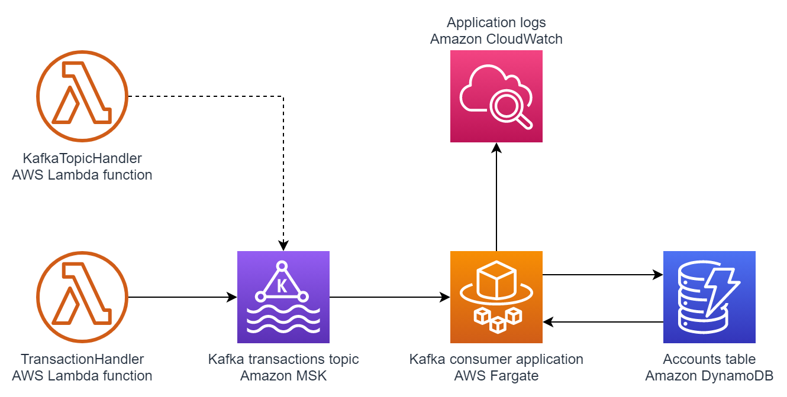

# Building Apache Kafka data processing Java application using AWS CDK
### Table of contents
1. [Introduction](#introduction)
2. [Architecture](#architecture)
3. [Project structure](#project-structure)
4. [Prerequisites](#prerequisites)
5. [Tools and services](#tools-and-services)
6. [Usage](#usage)
7. [Clean up](#clean-up)

## Introduction
This project provides an example of Apache Kafka data processing application. The build and deployment of the application if fully automated using AWS CDK.

Project consists of three main parts:
* AWS infrastructure and deployment definition - AWS CDK scripts written in Typescript
* AWS Lambda function - sends messages to Apache Kafka topic using [KafkaJS](https://kafka.js.org/) library. It is implemented in Typescript.
* Consumer application - Spring Boot Java application containing main business logic of the data processing pipeline. It consumes messages from Apache Kafka topic, performs simple validation and processing and stores results in Amazon DynamoDB table.

Provided example show cases two ways of packaging and deploying business logic using high-level AWS CDK constructs. 
One way using Dockerfile and AWS CDK ECS [`ContainerImage`](https://docs.aws.amazon.com/cdk/api/latest/docs/@aws-cdk_aws-ecs.ContainerImage.html) to deploy Java application to AWS Fargate 
and the other way is using AWS CDK [`NodejsFunction`](https://docs.aws.amazon.com/cdk/api/latest/docs/@aws-cdk_aws-lambda-nodejs.NodejsFunction.html) construct to deploy Typescript AWS Lambda code
## Architecture


Triggering AWS Lambda function publishes messages to Apache Kafka topic. 
Application containerised and deployed to AWS Fargate consumes messages from Kafka topic, processes them and store results in Amazon DynamoDB table.
Both lambda function and consumer application publish logs to Amazon CloudWatch.  

## Project structure
* [`amazon-msk-java-app-cdk/lib`](amazon-msk-java-app-cdk/lib) - directory containing all [AWS CDK stacks](https://docs.aws.amazon.com/cdk/latest/guide/stacks.html)
* [`amazon-msk-java-app-cdk/bin`](amazon-msk-java-app-cdk/bin) - directory containing [AWS CDK app definition](https://docs.aws.amazon.com/cdk/latest/guide/apps.html)
* [`amazon-msk-java-app-cdk/lambda`](amazon-msk-java-app-cdk/lambda) - directory containing code of `TransactionHandler` AWS Lambda function
* [`consumer`](consumer) - directory containing code of Kafka consumer Spring Boot Java application
* [`consumer/docker/Dockerfile`](consumer/docker/Dockerfile) - definition of Docker image used for AWS Fargate container deployment
* [`doc`](doc) - directory containing architecture diagrams
* [`scripts`](scripts) - directory containing deployment scripts

## Prerequisites
* An active AWS account
* Java SE Development Kit (JDK) 11, installed 
* [Apache Maven](https://maven.apache.org/), installed
* [AWS Cloud Development Kit (AWS CDK)](https://docs.aws.amazon.com/cdk/latest/guide/getting_started.html), installed
* [AWS Command Line Interface (AWS CLI)](https://docs.aws.amazon.com/cli/latest/userguide/install-cliv2.html) version 2, installed
* [Docker](https://docs.docker.com/get-docker/), installed

## Tools and services
* [AWS CDK](https://aws.amazon.com/cdk/) – The AWS Cloud Development Kit (AWS CDK) is a software development framework for defining your cloud infrastructure and resources by using programming languages such as TypeScript, JavaScript, Python, Java, and C#/.Net.
* [Amazon MSK](https://aws.amazon.com/msk/) - Amazon Managed Streaming for Apache Kafka (Amazon MSK) is a fully managed service that makes it easy for you to build and run applications that use Apache Kafka to process streaming data.
* [AWS Fargate](https://aws.amazon.com/fargate/) – AWS Fargate is a serverless compute engine for containers. Fargate removes the need to provision and manage servers, and lets you focus on developing your applications.
* [AWS Lambda](https://aws.amazon.com/lambda/) -  AWS Lambda is a serverless compute service that lets you run code without provisioning or managing servers, creating workload-aware cluster scaling logic, maintaining event integrations, or managing runtimes.
* [Amazon DynamoDB](https://aws.amazon.com/dynamodb/) -  Amazon DynamoDB is a key-value and document database that delivers single-digit millisecond performance at any scale.

## Usage 
1. Start the Docker daemon on your local system. The AWS CDK uses Docker to build the image that is used in the AWS Fargate task. You must run Docker before you proceed to the next step.
2. `export AWS_PROFILE=<REPLACE WITH YOUR AWS PROFILE NAME>` or alternatively follow instructions in the [AWS CDK documentation](https://docs.aws.amazon.com/cdk/latest/guide/getting_started.html#getting_started_prerequisites)
3. (First-time AWS CDK users only) Follow instructions on [AWS CDK documentation](https://docs.aws.amazon.com/cdk/latest/guide/getting_started.html#getting_started_bootstrap) page to bootstrap AWS CDK
4. `cd scripts`
5. Run `deploy.sh` script
6. Trigger lambda function to send message to Kafka queue. You can use below command line or alternatively you can trigger lambda function from AWS console. Fell free to change values of `accountId` and `value` fields in the payload JSON and send multiple messages with different payloads to experiment with the application. 
   ```shell
   aws lambda invoke --cli-binary-format raw-in-base64-out --function-name TransactionHandler --log-type Tail --payload '{ "accountId": "account_123", "value": 456}' /dev/stdout --query 'LogResult' --output text | base64 -d
   ```
7. To view results in DynamoDB table you can run below command. Alternatively you can navigate to Amazon DynamoDB AWS console and select `Accounts` table.
    ```shell
    aws dynamodb scan --table-name Accounts --query "Items[*].[id.S,Balance.N]" --output text
    ```
8. You can also view CloudWatch logs in AWS console or by running [`aws logs tail` command](https://awscli.amazonaws.com/v2/documentation/api/latest/reference/logs/tail.html) with specified CloudWatch Logs group  

## Clean up
Follow [AWS CDK instructions](https://docs.aws.amazon.com/cdk/latest/guide/hello_world.html#hello_world_tutorial_destroy) to remove AWS CDK stacks from your account.
Be sure to also [remove Amazon DynamoDB table](https://docs.aws.amazon.com/amazondynamodb/latest/developerguide/WorkingWithTables.Basics.html#WorkingWithTables.Basics.DeleteTable), [clean up Amazon CloudWatch logs](https://awscli.amazonaws.com/v2/documentation/api/latest/reference/logs/delete-log-group.html) and [remove Amazon ECR images](https://docs.aws.amazon.com/AmazonECR/latest/userguide/delete_image.html) to avoid incurring additional AWS infrastructure costs.
